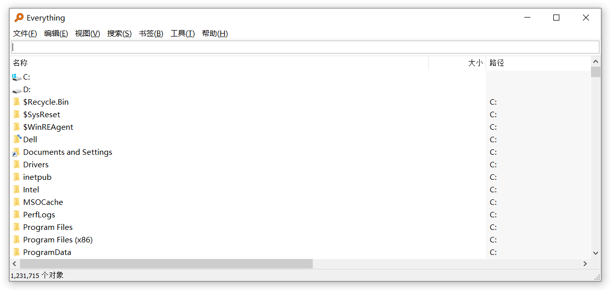
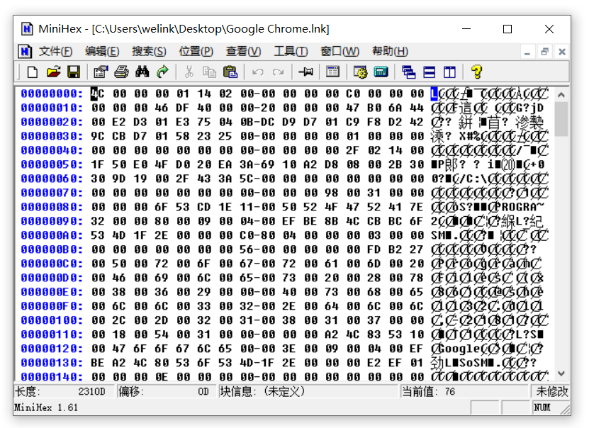
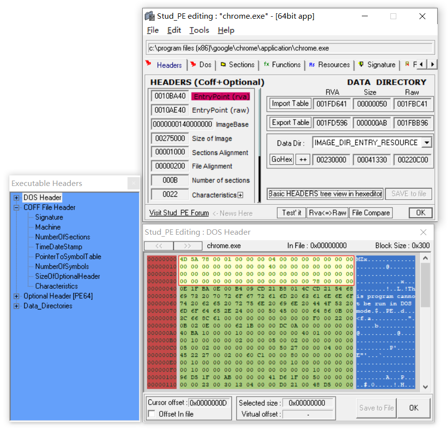
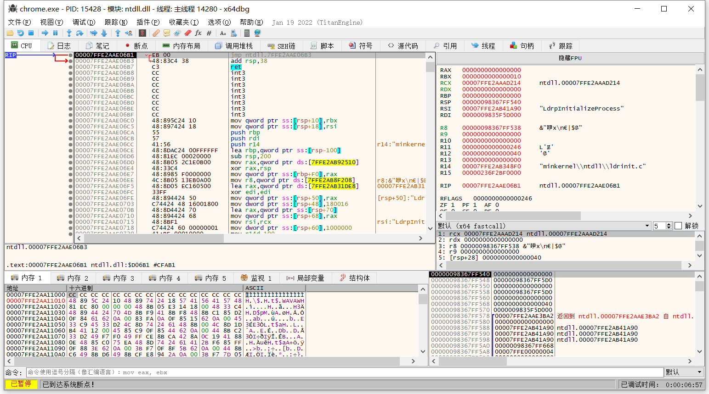
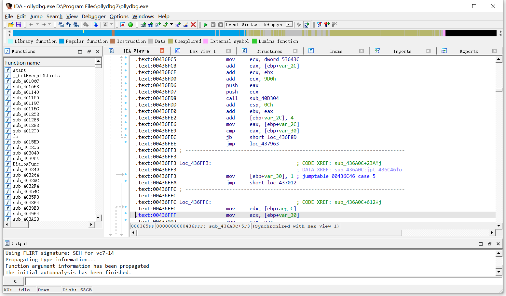

# win32_tools
win32开发必备工具;Necessary tools for Windows development

**everything**

Everything是voidtools开发的一款文件搜索工具，官网描述为“基于名称实时定位文件和目录（Locate files and folders by name instantly）

**Typora**

免费的跨平台Markdown编辑器

**Notepad++**

Notepad++是一款免费的文本/代码编辑器

**UltraEdit**

UltraEdit是用于Microsoft Windows上的一套商业性文本编辑器。它有强大的编程功能，是理想的文本、HTML和十六进制编辑器，收费

**VScode**

Visual Studio Code是一款由微软开发且跨平台的免费源代码编辑器

**Git**

Git 是一个开源的分布式版本控制系统

**MiniHex**

MiniHex是一款开放源代码的、小巧而实用的十六进制编辑器

**SysinternalsSuite**

Sysinternals Suite是微软官方发布的系统工具包，其中包含几十款实用的绿色系统工具软件，个个身怀绝技，是你维护Windows系统不可或缺的好帮手。最新版Sysinternals Suite包含69款系统工具的32位和64位版本，都是绿色软件，无需安装即可使用。把它放在你的U盘里，那就是你的随身系统工具箱

**Beyond Compare**

BeyondCompare是一款不可多得的专业级的文件夹和文件对比工具。使用它可以很方便的对比出两个文件夹或者文件的不同之处，并把相差的每一个字节用颜色予以表示，查看方便，并且支持多种规则对比

**Sublime Text**

Sublime Text 是一个文本编辑器（收费软件，可以无限期试用，但是会有激活提示弹窗），同时也是一个先进的代码编辑器

**XML验证器**

[XML验证器](https://www.runoob.com/xml/xml-validator.html)

**Microsoft Spy++**

一款强有力的编程辅助工具，对分析窗体结构有独到之处

**Microsoft SQL Server Management Studio**

用于管理 SQL Server的客户端

**StudPE**

PE分析综合工具

**Fiddler**

Fiddler是一个http调试代理，它能够记录并检查所有你的电脑和互联网之间的http通讯

**MySQL Workbench**

Mysql官方推出的客户端

**Studio 3T for MongoDB**

MongoDB客户端

**Microsoft Visual Studio**

Win32完整的开发工具集，它包括了整个软件生命周期中所需要的大部分工具

**OBS Studio**

一款开源软件,为用户提供了视频、文本、图像等的捕获录制功能.界面简洁,功能强大

**Dev-C++**

Dev-C++是一个Windows环境下的一个适合于初学者使用的轻量级 C/C++ 集成开发环境（IDE）。它是一款自由软件，遵守GPL许可协议分发源代码

**Node.js**

Node.js 是一个基于 Chrome V8 引擎的 JavaScript 运行时

**The X 在线工具箱**

[The X 在线工具箱](https://the-x.cn/)

**010 Editor**

在解析和编辑一切可视的二进制文件方面功能强大,有别于传统的十六进制编辑器

**x64dbg**

x64dbg是一款操作简单的Win32调试工具，它采用QT编写，是Windows 下的 32/64 位调试器,类似 Ollydbg。熟悉 Ollydbg 调试工具的应该很容易上手。整体前景比较乐观，功能有待更强

**UPX**

一款先进的可执行程序文件压缩器，压缩过的可执行文件体积缩小50%-70% ，这样减少了磁盘占用空间、网络上传下载的时间和其它分布以及存储费用

**Cutter**

Cutter 的目标是成为一个先进的免费和开源逆向工程平台，同时将用户体验牢记在心，Cutter由逆向工程师为反向工程师创建

**GDA**

GGJoy Dex Analysizer(GDA)，国内第一款也是唯一一款全交互式反编译器，并且其不仅只是反编译器，同时也是一款强大、轻便的综合性逆向分析利器，其不依赖任何java库且支持apk,dex,odex,oat,aar,jar,class文件， 支持python脚本自动化以及方法签名制作与识别

**JADX**

Command line and GUI tools for producing Java source code from Android Dex and Apk files

**IDA**

静态反编译软件

